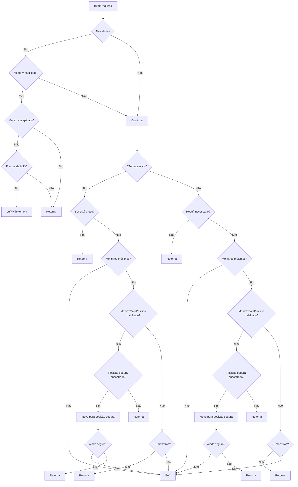

# Plano de Correção: CTA Buff com MoveToSafePositionForBuff

## Problema Identificado

Quando o bot precisa de CTA (Call to Arms) e há inimigos por perto, ele deveria procurar uma área segura e ir até lá para aplicar o buff. Essa funcionalidade existia antes, mas foi removida em uma modificação recente.

### Comportamento Atual (INCORRETO)

No arquivo [`internal/action/buff.go`](internal/action/buff.go:249-277), quando CTA é necessário:

```go
if needsCTABuff(ctx) {
    // ... verificações ...

    // Check if there are monsters close to the character
    const safeDistanceForBuff = 35
    closeMonsters := 0
    for _, m := range ctx.Data.Monsters {
        if ctx.PathFinder.DistanceFromMe(m.Position) < safeDistanceForBuff {
            closeMonsters++
        }
        if closeMonsters >= 1 {
            break
        }
    }

    // Only apply CTA if safe (no monsters nearby or in town)
    if closeMonsters > 0 && !ctx.Data.PlayerUnit.Area.IsTown() {
        ctx.Logger.Debug("CTA buffs needed but monsters nearby, skipping for safety")
        return  // ❌ SIMPLISMENTE PULA O BUFF
    }

    ctx.Logger.Debug("CTA buffs (BO/BC) missing in BuffIfRequired, calling Buff immediately")
    Buff()
    return
}
```

### Comportamento Esperado (CORRETO)

Para buffs normais (não CTA), a lógica já existe corretamente nas linhas 279-352:

```go
// Check if MoveToSafePositionForBuff is enabled in config
moveToSafePosition := ctx.CharacterCfg != nil && ctx.CharacterCfg.Character.MoveToSafePositionForBuff

// Check if there are monsters close to the character
closeMonsters := 0
for _, m := range ctx.Data.Monsters {
    if ctx.PathFinder.DistanceFromMe(m.Position) < safeDistanceForBuff {
        closeMonsters++
    }
    if closeMonsters >= 1 {
        break
    }
}

// If monsters are nearby and feature is enabled, try to find and move to a safe position first
if closeMonsters > 0 && moveToSafePosition && !ctx.CurrentGame.IsStuck {
    ctx.Logger.Debug("Monsters nearby, searching for safe position to buff...")

    safePos, found := FindSafePositionForBuff(safeDistanceForBuff, maxSearchDistance)
    if found && safePos != ctx.Data.PlayerUnit.Position {
        ctx.Logger.Debug("Moving to safe position for buffing",
            slog.Int("x", safePos.X),
            slog.Int("y", safePos.Y))

        // Move to the safe position before buffing
        err := MoveToCoords(safePos)
        if err != nil {
            ctx.Logger.Debug("Failed to move to safe buff position, will try to buff anyway",
                slog.String("error", err.Error()))
        }

        // Refresh data after moving
        ctx.RefreshGameData()

        // Verify that the position is still safe after movement
        closestMonsterDist := GetDistanceFromClosestEnemy(ctx.Data.PlayerUnit.Position, ctx.Data.Monsters)
        if closestMonsterDist < float64(safeDistanceForBuff) {
            ctx.Logger.Debug("Safe position no longer safe after movement (monsters may have moved), aborting buff",
                slog.Float64("closestMonsterDistance", closestMonsterDist),
                slog.Int("requiredDistance", safeDistanceForBuff))
            return
        }
    } else if !found {
        ctx.Logger.Debug("No safe position found for buffing, skipping buff this time")
        return
    }
} else if closeMonsters > 0 && !moveToSafePosition {
    // Feature disabled, use old behavior: don't buff if 2+ monsters nearby
    if closeMonsters >= 2 {
        return
    }
}
```

## Solução Proposta

Modificar a lógica de CTA (linhas 249-277) para incluir a mesma funcionalidade de `MoveToSafePositionForBuff` que existe para buffs normais.

### Alterações Necessárias

1. **Mover a verificação de `MoveToSafePositionForBuff` para antes do bloco CTA**
   - Isso permite que a mesma lógica seja usada tanto para CTA quanto para buffs normais

2. **Aplicar a lógica de mover para posição segura ao CTA**
   - Quando CTA é necessário e há monstros por perto, verificar se `MoveToSafePositionForBuff` está habilitado
   - Se estiver habilitado, tentar encontrar uma posição segura e mover até lá
   - Se não estiver habilitado, usar o comportamento antigo (não buffar se 2+ monstros por perto)

### Fluxo Corrigido

```go
// Check if MoveToSafePositionForBuff is enabled in config
moveToSafePosition := ctx.CharacterCfg != nil && ctx.CharacterCfg.Character.MoveToSafePositionForBuff

// Check if there are monsters close to the character
const safeDistanceForBuff = 35
closeMonsters := 0
for _, m := range ctx.Data.Monsters {
    if ctx.PathFinder.DistanceFromMe(m.Position) < safeDistanceForBuff {
        closeMonsters++
    }
    if closeMonsters >= 1 {
        break
    }
}

// Check CTA immediately without cooldown - if CTA is needed, buff immediately
// BUT first check if it's safe to buff (no monsters nearby and not stuck)
if needsCTABuff(ctx) {
    // Check if bot is stuck - don't try to buff if stuck
    if ctx.CurrentGame.IsStuck {
        ctx.Logger.Debug("CTA buffs needed but bot is stuck, skipping buff")
        return
    }

    // If monsters are nearby and feature is enabled, try to find and move to a safe position first
    if closeMonsters > 0 && moveToSafePosition && !ctx.CurrentGame.IsStuck {
        ctx.Logger.Debug("CTA buffs needed and monsters nearby, searching for safe position to buff...")

        const maxSearchDistance = 55
        safePos, found := FindSafePositionForBuff(safeDistanceForBuff, maxSearchDistance)
        if found && safePos != ctx.Data.PlayerUnit.Position {
            ctx.Logger.Debug("Moving to safe position for CTA buffing",
                slog.Int("x", safePos.X),
                slog.Int("y", safePos.Y))

            // Move to the safe position before buffing
            err := MoveToCoords(safePos)
            if err != nil {
                ctx.Logger.Debug("Failed to move to safe CTA buff position, will try to buff anyway",
                    slog.String("error", err.Error()))
            }

            // Refresh data after moving
            ctx.RefreshGameData()

            // Verify that the position is still safe after movement
            closestMonsterDist := GetDistanceFromClosestEnemy(ctx.Data.PlayerUnit.Position, ctx.Data.Monsters)
            if closestMonsterDist < float64(safeDistanceForBuff) {
                ctx.Logger.Debug("Safe position no longer safe after movement (monsters may have moved), aborting CTA buff",
                    slog.Float64("closestMonsterDistance", closestMonsterDist),
                    slog.Int("requiredDistance", safeDistanceForBuff))
                return
            }
        } else if !found {
            ctx.Logger.Debug("No safe position found for CTA buffing, skipping buff this time")
            return
        }
    } else if closeMonsters > 0 && !moveToSafePosition {
        // Feature disabled, use old behavior: don't buff if 2+ monsters nearby
        if closeMonsters >= 2 {
            ctx.Logger.Debug("CTA buffs needed but monsters nearby and MoveToSafePositionForBuff disabled, skipping for safety")
            return
        }
    }

    ctx.Logger.Debug("CTA buffs (BO/BC) missing in BuffIfRequired, calling Buff immediately")
    Buff()
    return
}
```

## Diagrama de Fluxo



## Arquivos a Serem Modificados

- [`internal/action/buff.go`](internal/action/buff.go:249-277) - Modificar a lógica de CTA para incluir `MoveToSafePositionForBuff`

## Funções Auxiliares Utilizadas

- [`FindSafePositionForBuff()`](internal/action/fight_tools.go:200) - Encontra uma posição segura para buffar
- [`MoveToCoords()`](internal/action/move.go) - Move para uma posição específica
- [`GetDistanceFromClosestEnemy()`](internal/action/fight_tools.go) - Calcula a distância do inimigo mais próximo

## Configuração

A funcionalidade é controlada pela configuração `MoveToSafePositionForBuff` no arquivo de configuração do personagem:

```yaml
character:
  moveToSafePositionForBuff: true # Habilita a funcionalidade de mover para posição segura
```

## Testes Sugeridos

1. **Teste com CTA necessário e monstros próximos:**
   - Configurar `MoveToSafePositionForBuff: true`
   - Colocar o bot em uma área com monstros próximos
   - Verificar se o bot move para uma posição segura antes de aplicar CTA

2. **Teste com CTA necessário e monstros próximos, feature desabilitada:**
   - Configurar `MoveToSafePositionForBuff: false`
   - Colocar o bot em uma área com 2+ monstros próximos
   - Verificar se o bot não aplica CTA (comportamento antigo)

3. **Teste com CTA necessário e sem monstros próximos:**
   - Colocar o bot em uma área segura
   - Verificar se o bot aplica CTA imediatamente

4. **Teste com CTA necessário, monstros próximos, mas sem posição segura disponível:**
   - Colocar o bot em uma área cercada por monstros
   - Verificar se o bot não aplica CTA e loga "No safe position found"
