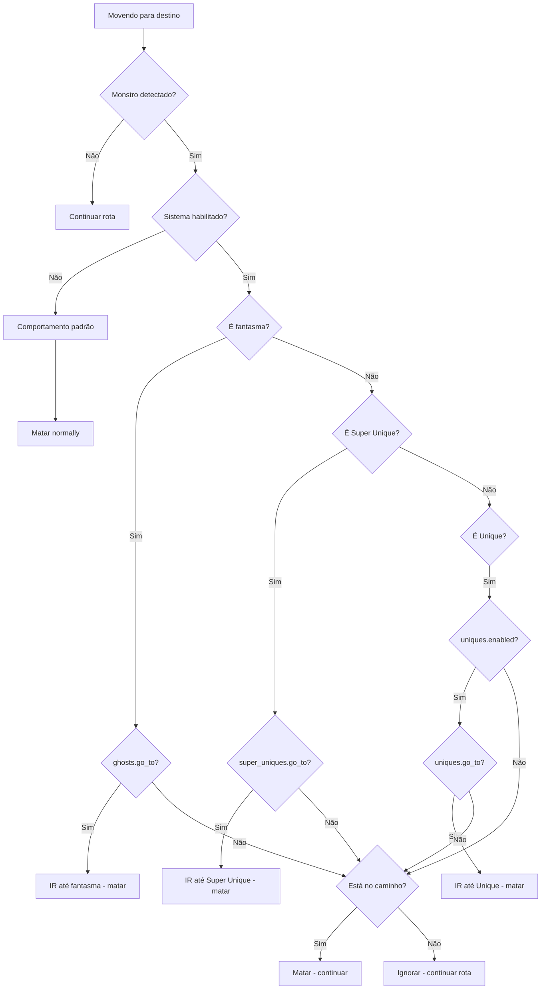

# Plano: Sistema de Drop Priority (Durante Movimentação)

## Objetivo

Melhorar a seleção de alvos durante a **movimentação normal** do bot, priorizando monstros com maior chance de dropar high runes.

## Princípios

- ** NÃO criar novas runs** - usar sistema existente
- **Ghosts são prioridade máxima** - melhor HR drop (tabela loot pequena)
- **Bosses/Super Uniques** - alto drop
- **Uniques** - podem ter bons drops
- **Configurável** - ativar/desabilitar por tipo de alvo e comportamento

## Mapeamento de Monstros Prioritários

```go
// ghostMonsters - Melhor HR drop (tabela loot pequena)
var ghostMonsters = map[npc.ID]bool{
    npc.Ghost:              true,
    npc.Wraith:            true,
    npc.Specter:           true,
    npc.Willowisp:         true,
    npc.FingerMage:        true,
    npc.DarkShape:         true,
    npc.SpectralHit:       true,
    npc.UndeadSoulKiller:  true,
    npc.BlackSoul:         true,
    npc.BurningSoul:       true,
}

// superUniqueMonsters - Super únicos com alto drop
var superUniqueMonsters = map[npc.ID]bool{
    npc.Nihlathak:         true,
    npc.Pindleskin:        true,
    npc.CouncilMember:     true,
    npc.IsmailVilehand:    true,
    npc.ToorcIcefist:      true,
    npc.BremmSparkfist:    true,
    npc.Skyrigger:         true,
    npc.Maelstorm:         true,
    npc.TheSummoner:       true,
    npc.Griswold:          true,
    npc.Rakanishu:         true,
    npc.TreeheadWoodfist:  true,
    npc.BloodRaven:        true,
    npc.Madone:            true,
    npc.EyebackUncurbed:   true,
    npc.SlakeUncurbed:     true,
    npc.FangSkin:          true,
    npc.Sscul:             true,
    npc.PitspawnFlesh:     true,
    npc.BoneAsh:           true,
}
```

## Sistema de Prioridade

```go
type TargetPriority int

const (
    PriorityNone TargetPriority = iota
    PriorityNormal
    PriorityGhost              // Fantasmas - melhor HR drop
    PrioritySuperUnique        // Super únicos
    PriorityUnique             // Uniques normais
)

// GetTargetPriority retorna prioridade baseada no tipo de monstro
func GetTargetPriority(m data.Monster) TargetPriority {
    if ghostMonsters[m.Name] {
        return PriorityGhost
    }
    if superUniqueMonsters[m.Name] {
        return PrioritySuperUnique
    }
    if m.IsUnique() {
        return PriorityUnique
    }
    return PriorityNormal
}

// IsOnPath verifica se monstro está na rota de movimento
func IsOnPath(m data.Monster, path []game.Position, threshold float64) bool {
    for _, pos := range path {
        if pather.DistanceFromPoint(m.Position, pos) <= threshold {
            return true
        }
    }
    return false
}
```

## Configuração (config.yaml)

```yaml
drop_priority:
  enabled: true # Ativar/desativar sistema

  # Fantasmas (melhor HR drop - tabela loot pequena)
  ghosts:
    enabled: true
    go_to: true # IR até ele na área
    kill_on_path: true # Matar se estiver no caminho
    priority: 100 # Maior prioridade

  # Super Únicos (alto drop)
  super_uniques:
    enabled: true
    go_to: true # IR até ele na área
    kill_on_path: true # Matar se estiver no caminho
    priority: 80

  # Uniques (menor prioridade)
  uniques:
    enabled: false # Por padrão, desativado
    go_to: false # Não ir até eles
    kill_on_path: true # Só matar se estiver no caminho
    priority: 50

  # Configurações de distância
  on_path_threshold: 15 # Units para considerar "no caminho"
  max_detour_distance: 40 # Max distance para desviar (GoTo)
```

## Interface (UI)

Adicionar nova seção em `config/template/config.yaml`:

```yaml
# Drop Priority Settings
# Improves target selection during movement to prioritize high rune drops
game:
  drop_priority:
    enabled: true
    ghosts:
      go_to: true
      kill_on_path: true
    super_uniques:
      go_to: true
      kill_on_path: true
    uniques:
      enabled: false
      go_to: false
      kill_on_path: true
    on_path_threshold: 15
    max_detour_distance: 40
```

Adicionar template UI em `run_settings_components.gohtml`:

```gohtml
{{ define "drop_priority" }}
    <fieldset>
        <legend>Drop Priority</legend>
        <p><small>Prioritize monsters with higher chance of dropping high runes during movement</small></p>

        <label>
            <input type="checkbox" name="gameDropPriorityEnabled"
                {{ if .Config.Game.DropPriority.Enabled }}checked{{ end }}>
            Enable Drop Priority System
        </label>

        <h5>Ghosts (Best HR Drop)</h5>
        <fieldset class="grid">
            <label>
                <input type="checkbox" name="gameDropPriorityGhostsGoTo"
                    {{ if .Config.Game.DropPriority.Ghosts.GoTo }}checked{{ end }}>
                Go to ghosts in area
            </label>
            <label>
                <input type="checkbox" name="gameDropPriorityGhostsKillOnPath"
                    {{ if .Config.Game.DropPriority.Ghosts.KillOnPath }}checked{{ end }}>
                Kill ghosts on path
            </label>
        </fieldset>

        <h5>Super Uniques</h5>
        <fieldset class="grid">
            <label>
                <input type="checkbox" name="gameDropPrioritySuperUniquesGoTo"
                    {{ if .Config.Game.DropPriority.SuperUniques.GoTo }}checked{{ end }}>
                Go to super uniques
            </label>
            <label>
                <input type="checkbox" name="gameDropPrioritySuperUniquesKillOnPath"
                    {{ if .Config.Game.DropPriority.SuperUniques.KillOnPath }}checked{{ end }}>
                Kill on path
            </label>
        </fieldset>

        <h5>Uniques</h5>
        <fieldset class="grid">
            <label>
                <input type="checkbox" name="gameDropPriorityUniquesEnabled"
                    {{ if .Config.Game.DropPriority.Uniques.Enabled }}checked{{ end }}>
                Enable unique priority
            </label>
            <label>
                <input type="checkbox" name="gameDropPriorityUniquesGoTo"
                    {{ if .Config.Game.DropPriority.Uniques.GoTo }}checked{{ end }}>
                Go to uniques
            </label>
        </fieldset>

        <h5>Distance Settings</h5>
        <fieldset class="grid">
            <label>
                On Path Threshold (units)
                <input type="number" name="gameDropPriorityOnPathThreshold"
                    value="{{ .Config.Game.DropPriority.OnPathThreshold }}" min="5" max="50">
            </label>
            <label>
                Max Detour Distance (units)
                <input type="number" name="gameDropPriorityMaxDetourDistance"
                    value="{{ .Config.Game.DropPriority.MaxDetourDistance }}" min="10" max="100">
            </label>
        </fieldset>
    </fieldset>
{{ end }}
```

## Hierarquia de Prioridade

| Prioridade | Tipo              | go_to padrão |
| ---------- | ----------------- | ------------ |
| 100        | **Ghosts**        | true         |
| 80         | **Super Uniques** | true         |
| 50         | **Uniques**       | false        |
| 10         | **Normais**       | (padrão)     |

## Fluxo de Execução



## Implementação

### Passo 1: Modificar clear_area.go

- [ ] Adicionar mapas de monstros prioritários
- [ ] Criar função `GetTargetPriority()`
- [ ] Criar função `IsOnPath()`
- [ ] Modificar `SortEnemiesByPriority()` para usar nova lógica

### Passo 2: Adicionar configuração

- [ ] Criar struct de configuração em `config/`
- [ ] Adicionar leitura de YAML
- [ ] Adicionar validação

### Passo 3: Adicionar UI

- [ ] Adicionar template `drop_priority` em `run_settings_components.gohtml`
- [ ] Integrar com a página de configurações

### Passo 4: Integrar com sistema de movimento

- [ ] Passar path atual para função de decisão
- [ ] Implementar lógica de "ir até" (go to)

### Passo 5: Testar

- [ ] Testar com runs existentes
- [ ] Ajustar distâncias
- [ ] Validar comportamento

## Resumo das Mudanças

| Arquivo                                                    | Mudança                                 |
| ---------------------------------------------------------- | --------------------------------------- |
| `internal/action/clear_area.go`                            | Adicionar mapas + funções de prioridade |
| `internal/config/`                                         | Adicionar configuração DropPriority     |
| `internal/server/templates/run_settings_components.gohtml` | Adicionar UI para Drop Priority         |
| `config/template/config.yaml`                              | Adicionar exemplo de configuração       |

---

**Nota:** O sistema é totalmente configurável. Por padrão, ghosts e super uniques têm `go_to: true`, uniques têm `go_to: false`.
