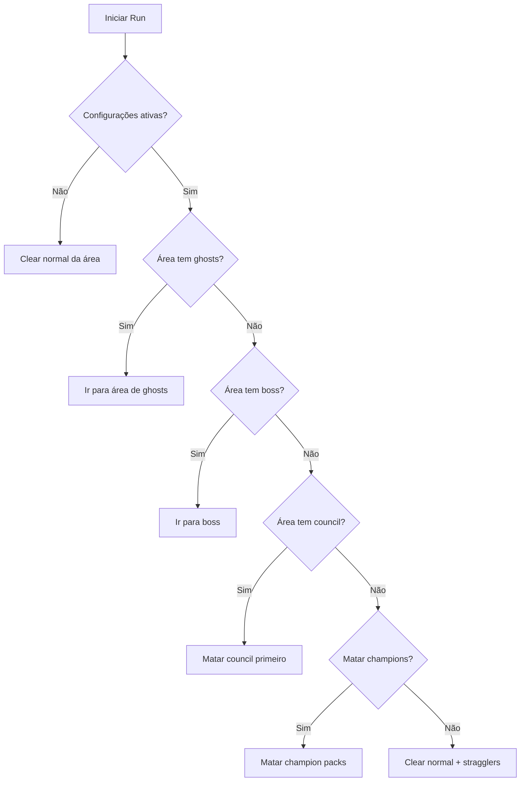

# Plano: Sistema de Drop Farming (High Runes)

## Visão Geral

Implementar um sistema inteligente de farming que prioriza monstros com maior chance de dropar high runes, baseado em pesquisas atualizadas para D2R Ladder 2026.

**Princípios Fundamentais:**

- MF não afeta runas! Foco em **kills/hora** (500-1000+ kills/hora ideal)
- Monstros com **tabela de loot pequena** (só runas/charms/jóias) têm maior chance relativa
- **Densidade** é mais importante que chance individual por kill
- **Volume vence** - HR são RNG pesada (~1:1M+ por kill médio)

## Tier List de Áreas para High Runes (2026)

| Tier  | Áreas                             | Motivo                                 | Kills/Hora |
| ----- | --------------------------------- | -------------------------------------- | ---------- |
| **S** | Secret Cow Level                  | Máxima densidade, reset rápido, seguro | 800-1200   |
| **A** | Chaos Sanctuary                   | Densidade alta, lvl 85, Diablo no fim  | 400-600    |
| **B** | Arcane Sanctuary, Forgotten Tower | Fantasmas + chests/keys                | 300-500    |
| **C** | The Pits                          | Lvl 85, seguro para noobs              | 300-400    |
| **D** | Worldstone Keep, Halls of Vaught  | Denso, mas perigoso/resets lentos      | 200-400    |
| **E** | Nihlathak (Halls of Vaught)       | Rei de Lo/Jah/Ber (boss)               | 50-100     |
| **F** | Pindleskin (Ancient's Way)        | Excelente para Ber/Jah                 | 50-100     |

## Monstros Prioritários para High Runes

### 1. Fantasmas (Ghosts, Specters, Wraiths)

**Por quê são os melhores:** Tabela de loot pequena (só runas/charms/jóias), alta chance relativa de HR.

```go
var ghostMonsters = map[npc.ID]bool{
    npc.Ghost:              true,
    npc.Wraith:             true,
    npc.Specter:            true,
    npc.Willowisp:          true,
    npc.FingerMage:         true,
    npc.DarkShape:          true,
    npc.SpectralHit:        true,
    npc.UndeadSoulKiller:   true, // Souls são ghosts
}
```

### 2. Bosses/Super Únicos (25+ rolls de drop)

**Por quê:** Mais rolls de drop, mlvl 86-87, drops extras.

```go
var bossMonsters = map[npc.ID]bool{
    npc.Nihlathak:          true, // Rei de Lo/Jah/Ber
    npc.Pindleskin:         true, // Excelente para Ber/Jah
    npc.Diablo:             true,
    npc.Baal:               true,
    npc.Mephisto:           true,
    npc.Duriel:             true,
    npc.Andariel:           true,
    npc.Radament:           true,
    npc.CouncilMember:      true, // Super único
    npc.IsmailVilehand:     true, // Council
    npc.ToorcIcefist:       true, // Council
    npc.BremmSparkfist:     true, // Council
    npc.Skyrigger:          true, // Council
    npc.Maelstorm:          true, // Council
}
```

### 3. Champions Packs (6-12 monstros)

**Por quê:** 2-4x melhor que normais, mais drops totais.

```go
var championMonsters = map[npc.ID]bool{
    // detection via elite type detection
}
```

### 4. Vacas (Hell Bovines)

**Por quê:** Densidade insana (400+/hora), fácil para qualquer build.

```go
var cowMonsters = map[npc.ID]bool{
    npc.HellBovine:          true,
    npc.BloodBringer:       true,
    npc.UmaShaman:          true,
}
```

## Sistema de Priorização

### Hierarquia de Prioridade

```go
type DropPriority int

const (
    DropPriorityLow DropPriority = iota
    DropPriorityNormal
    DropPriorityGhost          // Fantasmas - melhor HR drop
    DropPriorityBoss           // Bosses/Super Únicos
    DropPriorityChampion      // Champion packs
    DropPriorityCouncil       // Council members
    DropPriorityCow           // Vacas - volume
)

type MonsterTargetData struct {
    Monster      data.Monster
    Priority     DropPriority
    Distance     int
    IsOnPath     bool
}
```

### Função de Priorização

```go
func GetDropPriority(m data.Monster) DropPriority {
    // 1. Fantasmas são prioridade máxima (melhor HR drop)
    if ghostMonsters[m.Name] {
        return DropPriorityGhost
    }

    // 2. Bosses/Super Únicos
    if bossMonsters[m.Name] {
        return DropPriorityBoss
    }

    // 3. Council Members (Travincal)
    if councilMonsters[m.Name] {
        return DropPriorityCouncil
    }

    // 4. Champions
    if m.IsChampion() {
        return DropPriorityChampion
    }

    // 5. Vacas
    if cowMonsters[m.Name] {
        return DropPriorityCow
    }

    return DropPriorityNormal
}
```

### Ordenação de Alvos

```go
func SortTargetsByDropPriority(targets *[]MonsterTargetData) {
    sort.Slice(*targets, func(i, j int) bool {
        ti := (*targets)[i]
        tj := (*targets)[j]

        // Prioridade mais alta primeiro
        if ti.Priority != tj.Priority {
            return ti.Priority > tj.Priority
        }

        // Se mesma prioridade, mais perto primeiro
        return ti.Distance < tj.Distance
    })
}
```

## Configurações do Sistema

### Configuração YAML

```yaml
# config/drop_farming.yaml
drop_farming:
  enabled: true # Ativar/desativar sistema completo

  # Priorização de alvos
  prioritize_ghosts: true # Priorizar fantasmas (melhor HR drop)
  prioritize_bosses: true # Priorizar bosses/super únicos
  prioritize_council: true # Priorizar Council (Travincal)
  prioritize_champions: true # Priorizar Champion packs
  prioritize_cows: true # Priorizar vacas (volume)

  # Comportamento de combate
  kill_stragglers: true # Matar monstros no caminho
  kill_elites: true # Matar elites em geral
  kill_bosses: true # Matar bosses se encontrar

  # Configurações de área
  preferred_runs:
    - "cows" # S-tier: máxima densidade
    - "chaos" # A-tier: bom balanceamento
    - "arcane" # B-tier: fantasmas
    - "trav" # Council farming
    - "pindle" # Boss farming
    - "nihlathak" # Boss farming

  # Terror Zones (quando ativas)
  use_terror_zones: true # Usar TZ quando ativas
  tz_priority_areas: # Priorizar TZ com ghosts/bosses
    - "arcane_sanctuary"
    - "halls_of_vaught"

  # Performance
  min_kills_per_hour: 300 # Mínimo de kills/hora esperado
  max_path_deviation: 15 # Quanto desviar da rota para kills
```

## Runs Recomendadas por Build

| Build              | Runs Recomendadas   | Kills/Hora Esperado |
| ------------------ | ------------------- | ------------------- |
| Nova Sorc          | Cows, Chaos, Arcane | 800-1200            |
| Lightning Sorc     | Cows, Trav, Chaos   | 700-1000            |
| Hammerdin          | Cows, Chaos, Trav   | 600-900             |
| Blizz Sorc         | Arcane, Pits, Cows  | 500-800             |
| Trapsin            | Cows, Trav, Chaos   | 500-800             |
| Hammerdin (Budget) | Cows                | 800-1200            |

## Fluxo de Execução



## Implementação

### Passo 1: Modificar clear_area.go

- [ ] Adicionar `ghostMonsters` map
- [ ] Adicionar `bossMonsters` map
- [ ] Adicionar `cowMonsters` map
- [ ] Adicionar `councilMonsters` map
- [ ] Criar função `GetDropPriority()`
- [ ] Modificar `SortEnemiesByPriority()` para usar nova lógica

### Passo 2: Adicionar configuração

- [ ] Criar struct de configuração em `config/`
- [ ] Adicionar leitura de YAML
- [ ] Adicionar validação de configurações

### Passo 3: Criar sequências de runs

- [ ] Criar sequência Cows (Secret Cow Level)
- [ ] Criar sequência Chaos Sanctuary
- [ ] Criar sequência Arcane Sanctuary
- [ ] Criar sequência Trav/Council
- [ ] Criar sequência Pindle/Nihlathak

### Passo 4: Implementar lógica de área

- [ ] Detectar tipo de área atual
- [ ] Aplicar prioridades específicas por área
- [ ] Calcular melhor rota para maximizar kills

### Passo 5: Testar e ajustar

- [ ] Testar com diferentes builds
- [ ] Medir kills/hora real
- [ ] Ajustar prioridades baseado em resultados

## Próximos Passos

1. ✅ Criar mapeamento completo de monstros
2. ⬜ Implementar código
3. ⬜ Testar com diferentes builds
4. ⬜ Ajustar baseado em resultados reais

---

**Nota:** O sistema foca em maximizar **kills/hora** (não MF), já que MF não afeta drops de runas. A chave é densidade de alvos + volume de kills.
